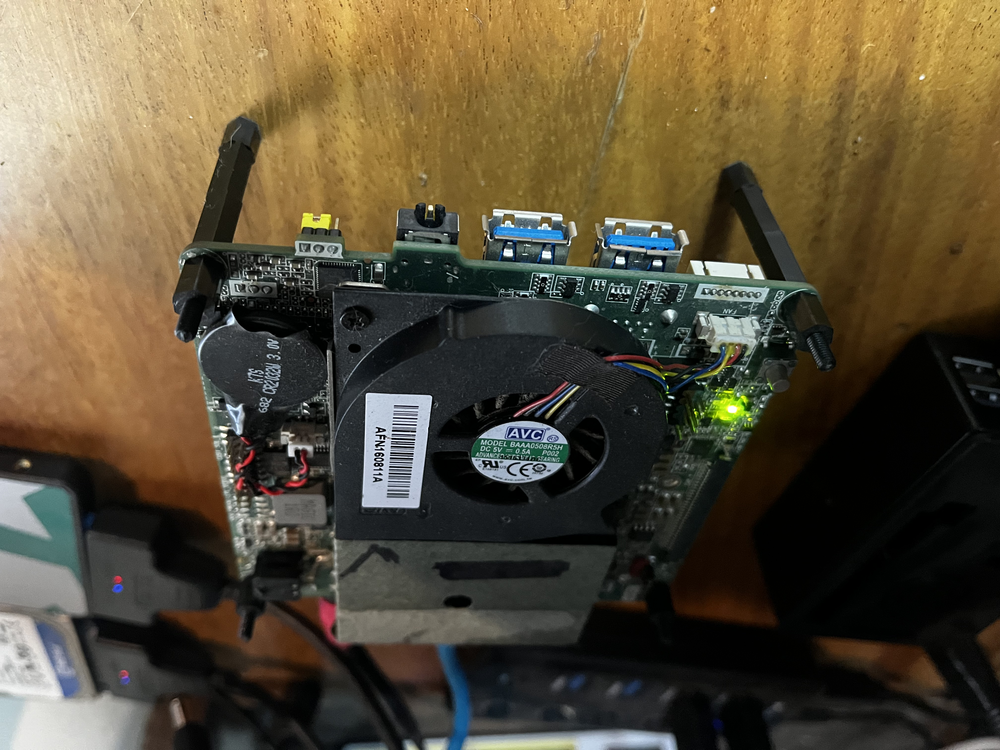
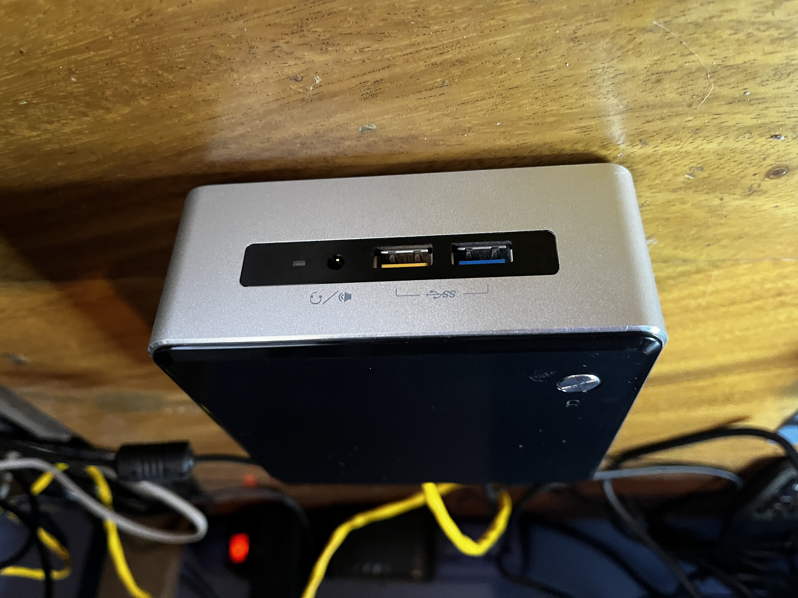
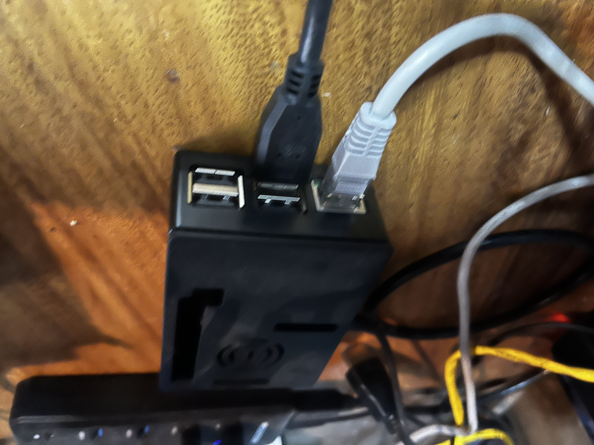
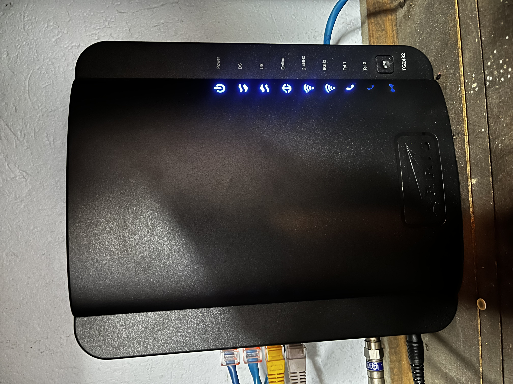
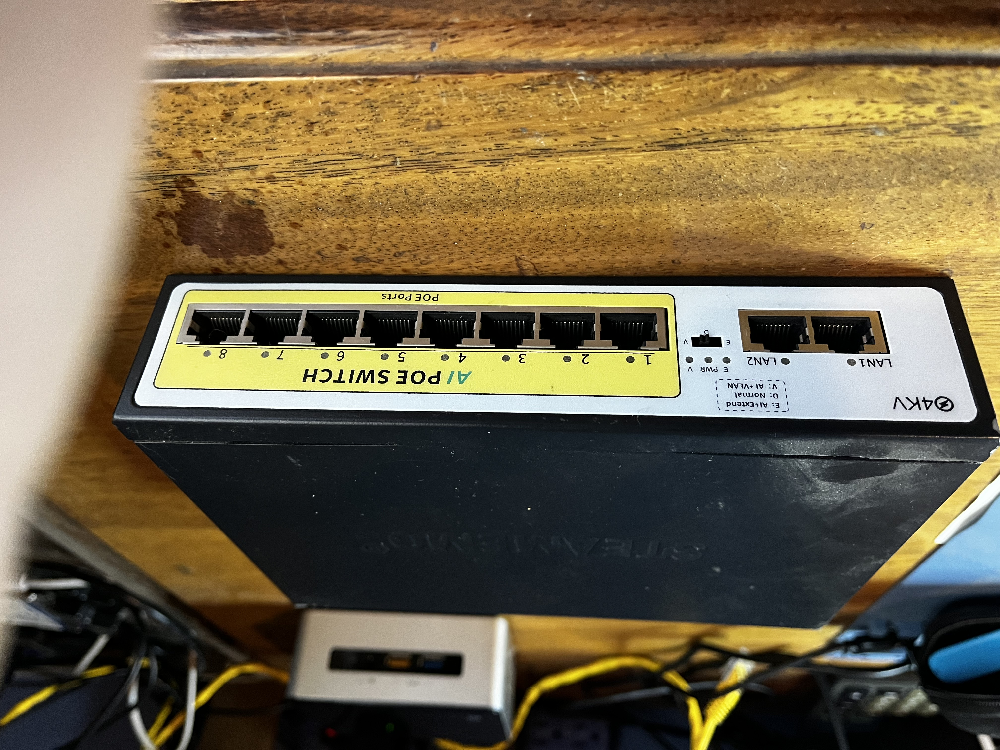
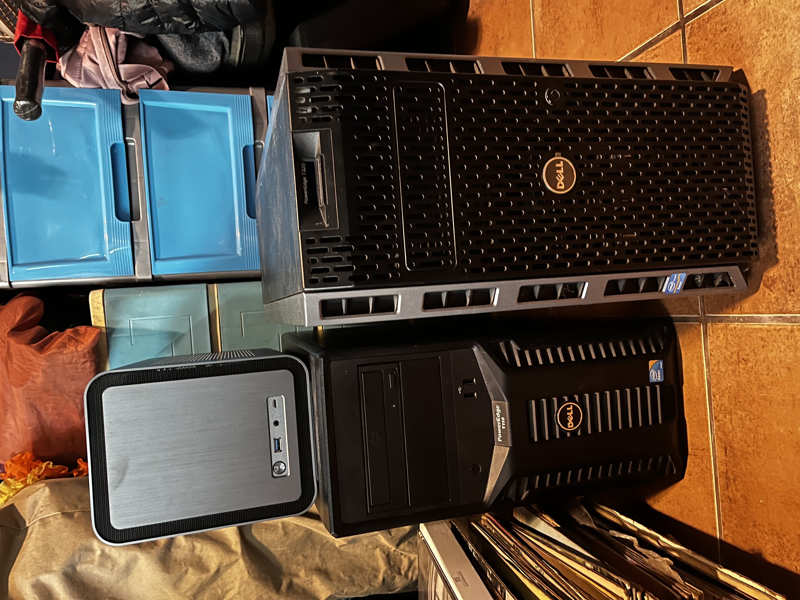
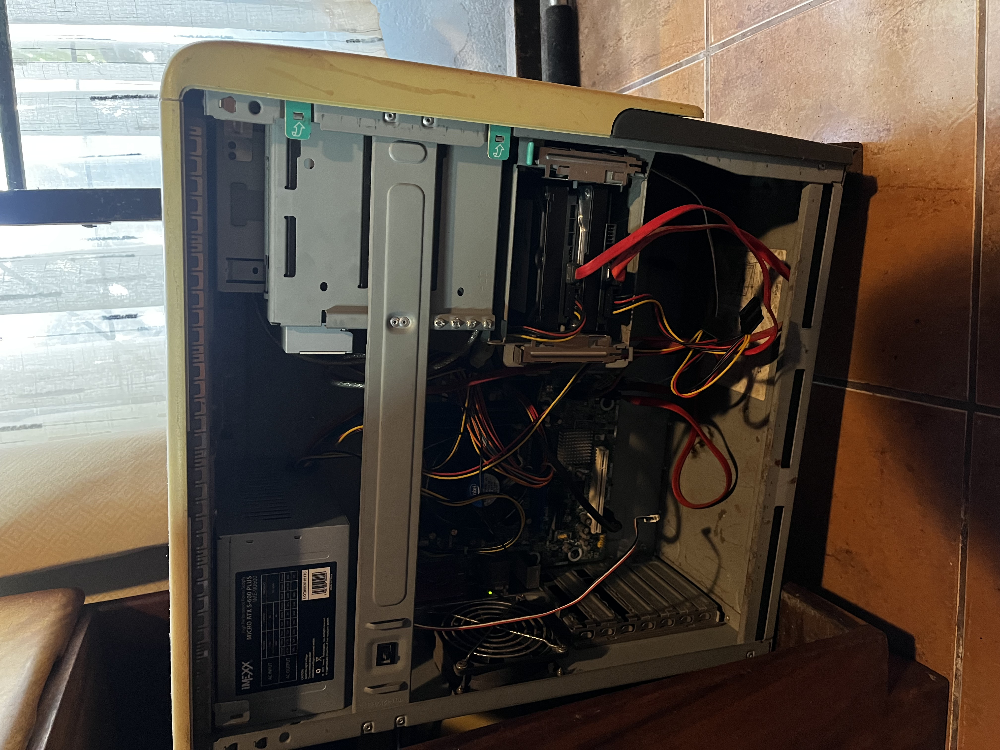
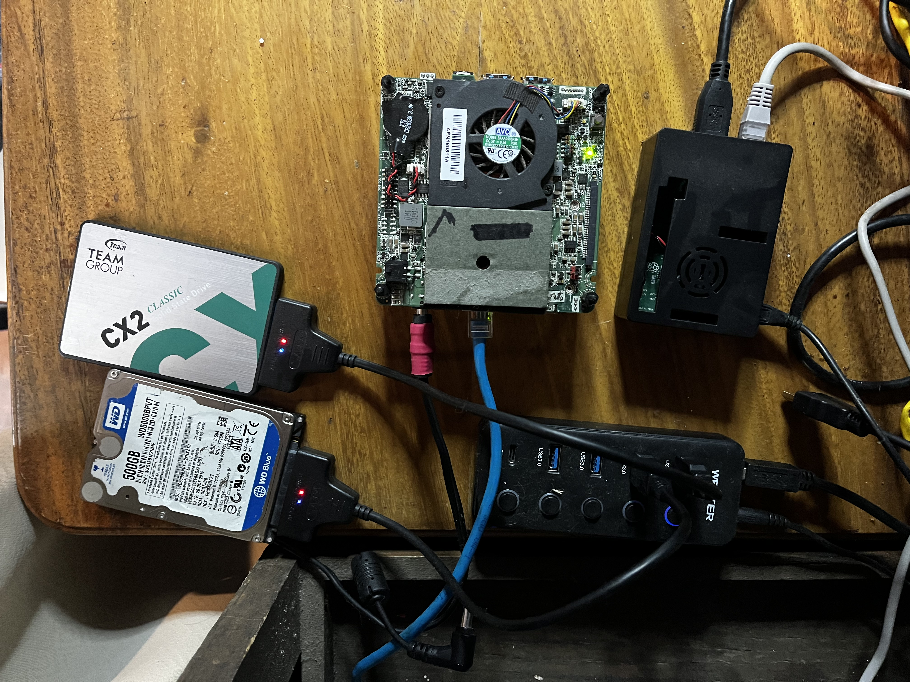
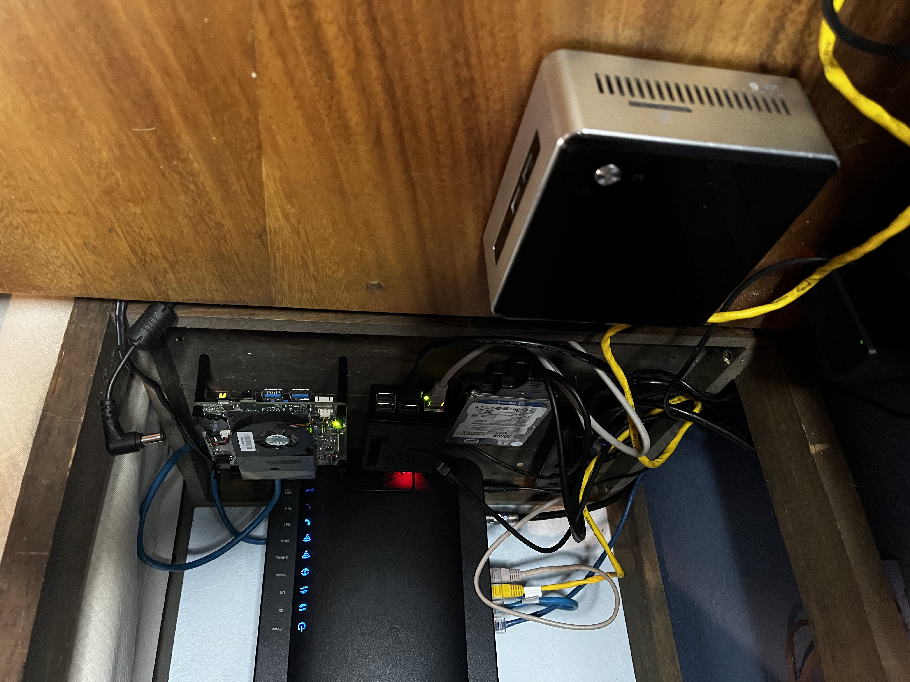
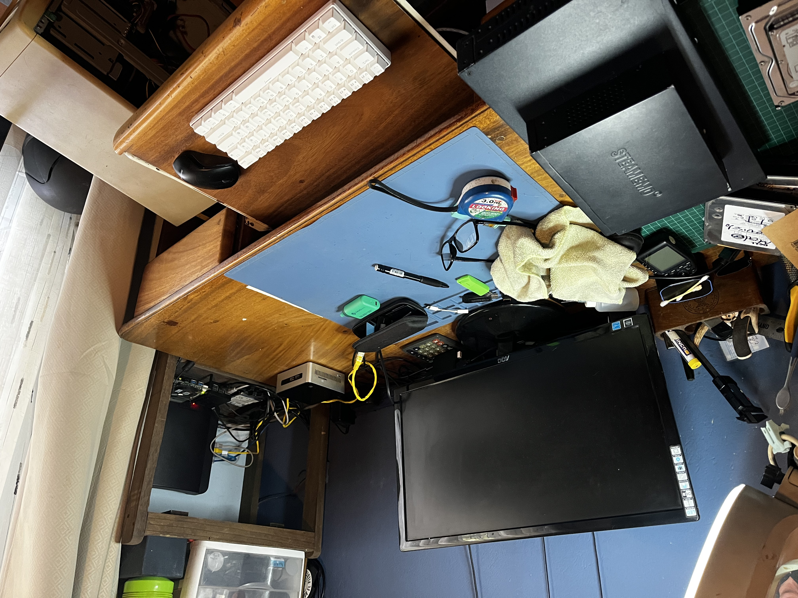

# Hardware Infrastructure Inventory

## Production Equipment (24/7 Operation)

### Intel NUC 5i3RYK - Proxmox Virtualization Host

**Specifications:**
- **CPU**: Intel i3-5010U (2.1GHz, 2 cores/4 threads)
- **RAM**: 16GB DDR3L SO-DIMM
- **Storage**: 500GB SSD (SATA)
- **Network**: Gigabit Ethernet
- **Power**: 65W TDP

**Current Role:**
- **Hypervisor**: Proxmox VE 8.x
- **Services**: Pi-hole LXC (1+ year uptime), Transmission LXC, GNS3 VM
- **Management**: Web UI accessible via internal network
- **Uptime**: Production 24/7 operation

**Performance Characteristics:**
- **CPU Usage**: 15-30% under normal household load
- **Memory**: 8-12GB allocated across containers and VMs
- **Storage**: SSD provides responsive I/O for virtualization
- **Network**: Single gigabit connection, adequate for current services

### Intel NUC 6i5SYK - Development Environment

**Specifications:**
- **CPU**: Intel i5-6260U (2.9GHz, 2 cores/4 threads)
- **RAM**: 16GB DDR4 SO-DIMM
- **Storage**: 500GB SSD
- **Network**: Gigabit Ethernet
- **Host OS**: Windows 11

**Current Role:**
- **Virtualization**: VMware Workstation
- **Services**: pfSense virtual firewall for security learning
- **Purpose**: Development and testing environment
- **Usage**: Active learning labs and experimentation

**Operational Experience:**
- **VM Management**: Snapshot and clone operations
- **Network Labs**: Virtual network configuration and testing
- **Security Practice**: Firewall rule development and validation
- **Resource Allocation**: Dynamic resource adjustment based on workload

### Raspberry Pi 2 - Network Attached Storage

**Specifications:**
- **CPU**: ARM Cortex-A7 quad-core (900MHz)
- **RAM**: 1GB LPDDR2
- **Storage**: 2TB HDD via USB 3.0
- **Network**: 100Mbps Ethernet
- **OS**: OpenMediaVault (Debian-based)

**Services Operational:**
- **OpenMediaVault**: Web-based NAS management interface
- **Plex Media Server**: Local network streaming (household media library)
- **File Shares**: SMB/CIFS for cross-platform access
- **Backup Target**: Automated backup destination for critical data

**Performance Notes:**
- **Network Limitation**: 100Mbps Ethernet bottleneck
- **Storage Interface**: USB 3.0 bandwidth adequate for streaming
- **Power Efficiency**: Low-power 24/7 operation (~5W)
- **Reliability**: Stable operation, regular maintenance schedule

## Network Infrastructure

### Arris TG2482 ISP Router

**Specifications:**
- **Technology**: DOCSIS 3.0 cable modem/router
- **WiFi**: 802.11ac dual-band (2.4GHz + 5GHz)
- **Ethernet**: 4x Gigabit LAN ports
- **Telephony**: Integrated voice service

**Current Configuration:**
- **Network**: Internal LAN with flat topology
- **DHCP**: Automatic IP assignment for clients
- **WiFi**: WPA2 security, dual-band operation
- **Port Forwarding**: Configured for remote service access

**Operational Status** (visible in photo):
- **Power**: Online and operational
- **DS/US**: Downstream/Upstream sync confirmed
- **Online**: Internet connectivity established
- **WiFi Bands**: Both 2.4GHz and 5GHz active
- **Tel**: Voice services operational

### POE Switch (Standby)

**Specifications:**
- **Type**: Managed POE switch
- **Ports**: Multiple gigabit ports with Power over Ethernet
- **Status**: Currently not in active use
- **Planned Use**: Future network segmentation and POE-powered devices

**Future Implementation:**
- VLAN segmentation when implemented
- POE-powered access points or cameras
- Managed switch capabilities for advanced networking

## Standby Equipment (Deployment Ready)

### Dell PowerEdge Servers

**Dell PowerEdge T320:**
- **CPU Socket**: Xeon E5-2400 series (currently unpopulated)
- **RAM**: 16GB ECC installed (expandable to 192GB)
- **Storage**: Drive bays available, no drives currently installed
- **Network**: Dual Gigabit Ethernet
- **Power**: Redundant PSU capability
- **Planned Role**: Kubernetes master node

**Dell PowerEdge T110 II:**
- **CPU Socket**: Xeon E3-1200 series (currently unpopulated)
- **RAM**: 16GB ECC installed (expandable to 32GB)
- **Storage**: SATA bays available
- **Network**: Dual Gigabit Ethernet
- **Planned Role**: Kubernetes worker node

**Deployment Planning:**
- CPU installation pending (budget consideration)
- Storage configuration for containerized workloads
- Network bonding configuration for cluster communication
- Learning objectives: Container orchestration, distributed systems

## Legacy Equipment

### Old PC Case

**Status**: Parts storage and potential reuse
**Components**: Various older hardware for experimentation
**Purpose**: Learning resource for hardware troubleshooting and component 
testing

## Complete Lab Setup

### Overview Photos

**Physical Layout:**
- **Workspace**: Dedicated desk area for homelab management
- **Equipment Arrangement**: Organized for accessibility and thermal 
management
- **Cable Management**: Functional routing (optimization planned)
- **Monitoring Access**: Direct console access to all production equipment

## Infrastructure Capabilities

### Current Implementation
- **Virtualization**: Production Proxmox and development VMware 
environments
- **Container Support**: LXC containers operational, Docker planned
- **Network Storage**: NAS services with media streaming and backup 
functionality
- **Service Management**: Web interfaces, SSH access, remote 
administration
- **Network Services**: DNS filtering (Pi-hole), VPN planning, firewall 
learning

### Planned Enhancements
- **VLAN Segmentation**: Security zones and network isolation (Priority 1)
- **Dell Server Deployment**: Kubernetes cluster implementation (Priority 
2)
- **Monitoring Stack**: Grafana + Prometheus observability (Priority 2)
- **Container Orchestration**: Docker Swarm or Kubernetes practical 
learning
- **Advanced Networking**: VPN server, advanced firewall rules, traffic 
analysis

### Skills Demonstrated
- **Hardware Assembly**: Component installation, configuration, 
troubleshooting
- **Hypervisor Management**: Proxmox and VMware administration
- **Network Administration**: Router configuration, service deployment
- **Storage Management**: NAS configuration, file services, backup 
strategies
- **Service Integration**: Multi-platform environment coordination

## Operational Metrics

### Reliability
- **Pi-hole Uptime**: 99%+ (1+ year operational as household DNS)
- **Service Availability**: Production services accessible 24/7
- **Hardware Stability**: No hardware failures during operational period
- **Performance**: Responsive under normal household workload

### Resource Utilization
- **CPU**: Adequate headroom for planned service expansion
- **Memory**: Current allocation sustainable, expansion capacity available
- **Storage**: Sufficient for current needs, scalable architecture
- **Network**: Gigabit backbone adequate for planned services

### Maintenance
- **Schedule**: Weekly monitoring, monthly maintenance windows
- **Documentation**: Configuration backup and change tracking
- **Backup Strategy**: Critical data protection and recovery procedures
- **Troubleshooting**: Systematic problem-solving with lessons learned 
documentation

## Learning Value

### Hands-On Experience
- **Real Production Environment**: 24/7 services with actual users 
(household)
- **Problem-Solving**: Troubleshooting real issues vs simulated scenarios
- **Service Management**: Uptime considerations, maintenance planning, 
user impact
- **Infrastructure Design**: Practical capacity planning and resource 
allocation

### Portfolio Demonstration
- **Visual Evidence**: Hardware photos prove real infrastructure vs 
theoretical claims
- **Operational Proof**: Long-term service uptime demonstrates reliability
- **Progressive Learning**: Clear path from basic to advanced 
implementations
- **Business Context**: Family usage provides real stakeholder 
requirements

### Career Relevance
- **DevOps Foundation**: Infrastructure management and service 
orchestration
- **Production Mindset**: Uptime awareness, change management, 
documentation
- **Systematic Approach**: Problem-solving methodology from Intel 
background
- **Scalability Planning**: Growth path from current state to enterprise 
concepts

---

**Documentation Status**: Active maintenance with regular updates
**Photo Date**: October 2025
**Next Update**: Post-VLAN implementation and Dell server deployment
